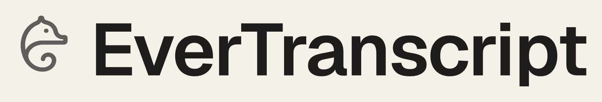

<picture>
  <source media="(prefers-color-scheme: dark)" srcset="brand/generated/lockups/lockup-dark@2x.png">
  
</picture>

# EverTranscript

A live and archived transcript of every meeting.

Transcribed locally with whisper.cpp, saved as plain markdown you own.

## Private by construction

**Your meetings never leave your machine — unless you turn on cloud summaries.**
